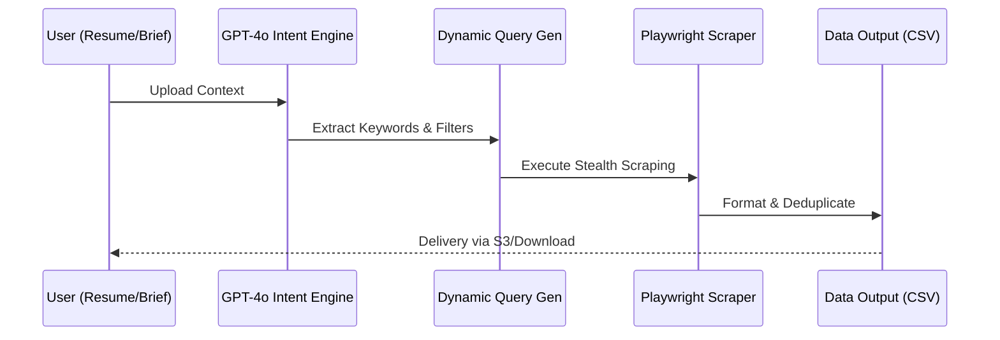
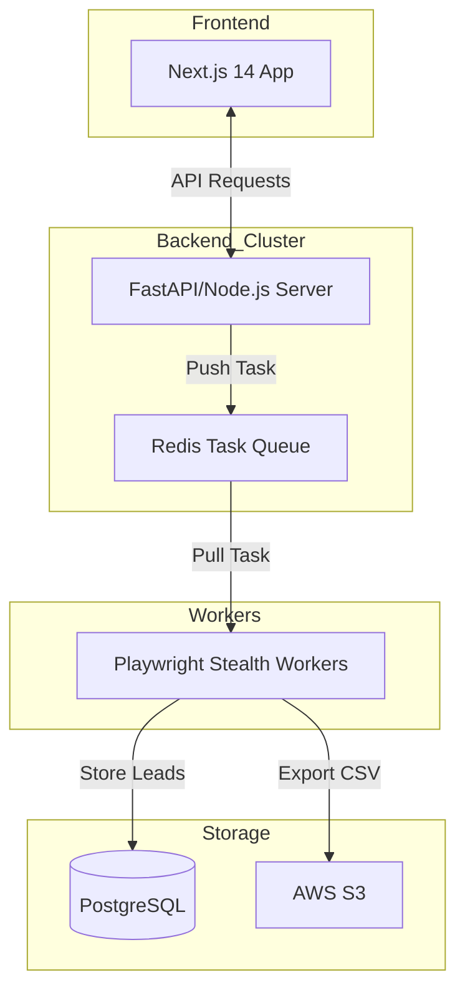
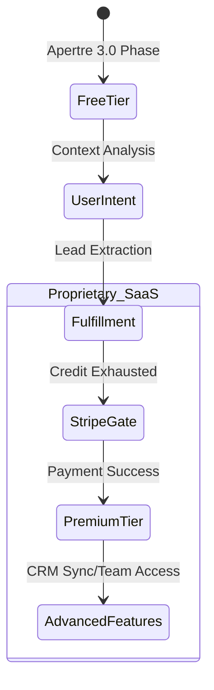

# 🚀 Lead Gen Tool: Dynamic Context-Aware Lead Scraping Engine

Lead Gen Tool is an intelligent, open-source lead generation platform built for the [Apertre 3.0](https://apertre.resourcio.in). It leverages LLMs and dynamic scraping logic to transform static professional data into actionable leads.

> **Project Status:** Currently in Open Source Competition Phase. Future roadmap includes a transition to a proprietary SaaS model with advanced monetization features.

---

## 📌 Table of Contents

- [🌟 Vision](#-vision)
- [🔄 Workflow Architecture](#-workflow-architecture)
- [System Visualization](#-system-visualization)
- [✨ Key Features](#-key-features)
- [🛠 Tech Stack](#-tech-stack)
- [💰 Monetization & Future (Commercial Path)](#-monetization--future-commercial-path)
- [🚀 Installation & Setup](#-installation--setup)
- [🤝 Contributing](#-contributing)
- [📄 License](#-license)

---

## 🌟 Vision

Lead Gen Tool democratizes access to high-value data. By parsing user intent—whether it's finding a job or sourcing B2B clients—the platform automates the extraction process, providing structured data based on the user's specific professional context.

## 🔄 Workflow Architecture

The application follows a linear, user-centric flow:

1.  **Identity**: Secure authentication.
2.  **Intent Engine**: Users select between **Career** (Job/Freelance) or **Growth** (Business Clients) paths.
3.  **Context Injection**: AI parses resumes or business briefs to generate dynamic search parameters.
4.  **Tiered Selection**: Choose volume (100, 200, 300 leads).
5.  **Data Fulfillment**: Asynchronous scraping and CSV export.

## System Visualization

**A. Context-Aware Workflow (Sequential)**
This diagram illustrates the "Intent Engine" logic, showing how raw user data is transformed into structured leads.



**B. System Architecture (Modular)**
A flowchart showing the decoupling of the frontend, backend, and the asynchronous task queue.



**C. Monetization & Lead Funnel (State Diagram)**
This diagram visualizes the transition from the open-source competition phase to a proprietary SaaS model.



## ✨ Key Features

-   **Dynamic Query Generation**: Uses **GPT-4o** to turn a resume into precise search filters.
-   **Contextual Scraping**: Adjusts target sites based on user persona (Indeed for jobs vs. LinkedIn/Directories for sales).
-   **Scalable Background Workers**: Redis-backed task queuing for high-volume extraction.
-   **Intelligent Deduplication**: Ensures lead quality by filtering out redundant or low-confidence data.

## 🛠 Tech Stack

-   **Frontend**: Next.js 14, Tailwind CSS, Shadcn UI.
-   **Backend**: Python (FastAPI) or Node.js (TypeScript).
-   **AI**: OpenAI API (GPT-4o).
-   **Scraping**: Playwright with stealth-evasion.
-   **Queue/DB**: Redis, PostgreSQL, AWS S3.

## 💰 Monetization & Future (Commercial Path)

Post-competition, Lead Gen Tool will transition into a premium SaaS product. Planned commercial features include:

-   **Tiered Subscription Plans**: Monthly credits for recurring lead generation.
-   **Payment Integration**: Stripe-powered "Pay-per-Lead-Pack" for guest users.
-   **CRM Sync**: Direct push to HubSpot, Salesforce, and Pipedrive.
-   **Team Workspaces**: Collaborative lead management for sales teams.

## 🚀 Installation & Setup

### 1. Clone & Install

```bash
git clone https://github.com/your-username/lead_gen_tool.git
cd lead_gen_tool
npm install
pip install -r requirements.txt
```

### 2. Environment Setup

Create a `.env` file with the following keys:
-   `OPENAI_API_KEY`
-   `REDIS_URL`
-   `DATABASE_URL`

### 3. Run Application

**Frontend:**
```bash
npm run dev
```

**Backend:**
```bash
python main.py
```

## 🤝 Contributing

Contributions are welcome during the competition period! Please see `CONTRIBUTING.md` for guidelines on code style and PR processes.

## 📄 License

This version of the project is released under the **MIT License**. Future proprietary versions will be subject to different commercial licensing terms.

---

**Community Standards:** Please review our [Code of Conduct](CODE_OF_CONDUCT.md) before contributing.

---
*Created for [Apertre 3.0](https://apertre.resourcio.in) Feb - Mar 2026.*
